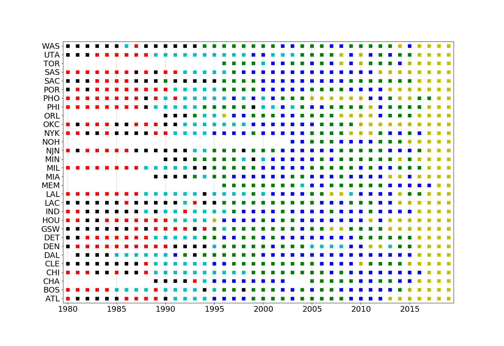

# nba_clustering

In this project, I use a PCA and clutering analysis to take a look at player and team statistics from the nba between 1980 and 2019.  

# Organization
/python/ contains lower level code that is implemented in jupyter notebooks contained in /scripts/.

# Fun Results  
### The most statistically unique seasons of all time:  
1 Michael Jordan 1987   
2 Michael Jordan 1988   
3 Michael Jordan 1989  
4 Moses Malone 1982  
5 David Robinson 1994  
6 Russel Westbrook 2017  
7 James Harden 2019  
8 Hakeem Olajuwon 1990   
9 Hakeem Olajuwon 1989  
10 Shaquille O'Neal 2001   
11 Charles Barkley 1987  
12 Hakeem Olajuwon 1993  
13 Hakeem Olajuwon 1994  
14 Shaquille O'Neal 2000  
15 Karl Malone 1989  
16 Shaquille O'Neal 1994  
17 Charles Barkley 1988  
18 James Harden 2017  
19 Hakeem Olajuwon 1995   
20 Karl Malone 1990  

### Team classification over time:  
Each color corresponds to a different classification of team stats.  Notably, playstyles have varied more over time than within a single season.  All teams today belong to the same classification, with the first teams to play with that style being the 1995 Houston Rockets, the 1996 Orlando Magic, and the 2005-2010 Phoenix Suns.  

